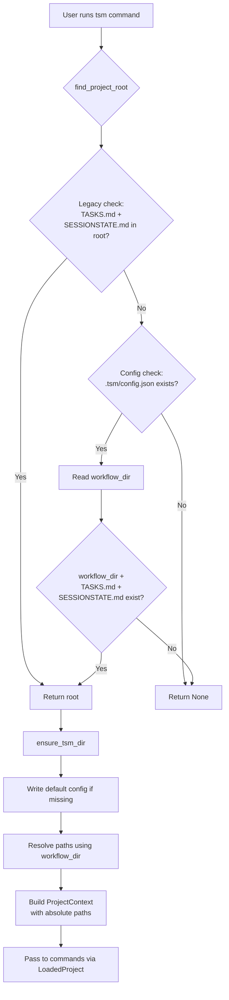
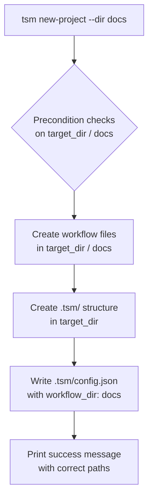

# Subdirectory Support for Workflow Files — Design Plan

## Goal

Allow users to store TASKS.md, SESSIONSTATE.md, and TASKS-COMPLETED.md in a
configurable subdirectory of the project root (e.g., `docs/`) instead of the
root directory itself.

---

## Design Overview

A new JSON config file at `.tsm/config.json` stores a `workflow_dir` key.
All three workflow file paths resolve relative to this directory.  If
`workflow_dir` is empty or the config file doesn't exist, everything behaves
exactly as before — **100% backward compatible**.

```
project-root/
├── .tsm/
│   ├── config.json          ← NEW: {"version": 1, "workflow_dir": "docs"}
│   ├── shadow/              ← unchanged
│   ├── backups/             ← unchanged
│   └── history.log          ← unchanged
├── docs/                    ← workflow_dir
│   ├── TASKS.md
│   ├── SESSIONSTATE.md
│   └── TASKS-COMPLETED.md
├── AGENTS.md                ← stays in root
├── SPECIFICATION.md         ← stays in root
├── .gitignore               ← stays in root
└── ... (source code)
```

---

## Configuration Schema

**File:** `.tsm/config.json`

```json
{
  "version": 1,
  "workflow_dir": "docs"
}
```

- `version` — always `1` for now; allows future schema evolution
- `workflow_dir` — relative path from project root. Empty string `""` means
  files are in root (default/legacy behavior)

If `.tsm/config.json` doesn't exist, all code defaults to `workflow_dir = ""`.

---

## Files to Create

### 1. `tsm/config.py` — Config read/write helpers (NEW)

```python
def read_tsm_config(root: Path) -> dict:
    """Read .tsm/config.json. Returns default dict if file doesn't exist."""
    # Returns {"version": 1, "workflow_dir": ""} as default

def write_tsm_config(root: Path, config: dict) -> None:
    """Write config to .tsm/config.json."""
```

---

## Files to Modify

### 2. `tsm/project.py` — Project discovery & path resolution

#### `find_project_root(start: Path) -> Path | None`

New algorithm — for each candidate directory (up to 3 levels above `start`):

1. **Legacy check:** Do `TASKS.md` AND `SESSIONSTATE.md` exist directly in
   the candidate? If yes → return candidate (0% behavior change).

2. **Config check:** Does `.tsm/config.json` exist in candidate? If yes →
   read config. Resolve `candidate / workflow_dir / "TASKS.md"` and
   `candidate / workflow_dir / "SESSIONSTATE.md"`. If both exist → return
   candidate.

3. If neither check passes → continue to next candidate.

Order matters: check legacy first so existing projects are found without
reading config at all.

#### `ensure_tsm_dir(root: Path) -> ProjectContext`

New behaviour:

1. Create `.tsm/shadow/` and `.tsm/backups/` (unchanged)
2. **NEW:** Write default `.tsm/config.json` if it doesn't exist
3. Read `.tsm/config.json` to get `workflow_dir`
4. Resolve paths:
   - `tasks_path = root / workflow_dir / "TASKS.md"`
   - `sessionstate_path = root / workflow_dir / "SESSIONSTATE.md"`
   - `tasks_completed_path = root / workflow_dir / "TASKS-COMPLETED.md"`
   - All other paths (`shadow_dir`, `backup_dir`, `history_log_path`) stay
     in root — unchanged
5. `.gitignore` enforcement (unchanged)
6. Return `ProjectContext` with resolved paths (unchanged struct)

Key invariant: After `ensure_tsm_dir()`, all paths in `ProjectContext` are
**absolute** — callers never need to resolve relative paths.

### 3. `tsm/shadow.py` — Undo with path mapping

#### `undo(ctx: ProjectContext) -> None`

Changed signature from `undo(root: Path)` to `undo(ctx: ProjectContext)`.

Inside the function, build a filename → live_path mapping:

```python
live_path_map = {
    "TASKS.md":           Path(ctx.tasks_path),
    "SESSIONSTATE.md":    Path(ctx.sessionstate_path),
    "TASKS-COMPLETED.md": Path(ctx.tasks_completed_path),
}
```

When restoring a file from backup, use:

```python
live_path = live_path_map.get(filename, root / filename)
```

This fallback (`root / filename`) ensures backward compatibility with any
future file types that aren't in the map.

All other logic (history log parsing, backup lookup, [undone] marking)
remains unchanged.

### 4. `tsm/commands/undo.py` — Pass context directly

Change:
```python
# Before:
shadow_undo(Path(ctx.root))

# After:
shadow_undo(ctx)
```

### 5. `tsm/commands/new_project.py` — `--dir` flag

#### Function signature change

```python
def new_project(
    target_dir: Path,
    name: str | None = None,
    workflow_dir: str = "",
) -> None:
```

#### Precondition checks

Check for existing files in `target_dir / workflow_dir`:

```python
if (target_dir / workflow_dir / "TASKS.md").exists(): ...
if (target_dir / workflow_dir / "SESSIONSTATE.md").exists(): ...
```

#### File creation

Write all workflow files to `target_dir / workflow_dir / filename`:

```python
write_dir = target_dir / workflow_dir
for filename, content in templates.items():
    (write_dir / filename).write_text(content, encoding="utf-8")
```

#### Config writing

After creating `.tsm/` directory, write `.tsm/config.json`:

```python
from tsm.config import write_tsm_config
write_tsm_config(target_dir, {"version": 1, "workflow_dir": workflow_dir})
```

#### Post-creation output

Update printed file paths to show the correct subdirectory.

### 6. `tsm/__main__.py` — Parse `--dir` flag

In `_handle_new_project()`, add `--dir` parsing:

```python
def _handle_new_project(rest: list[str]) -> None:
    name = None
    workflow_dir = ""
    i = 0
    while i < len(rest):
        if rest[i] == "--name" and i + 1 < len(rest):
            name = rest[i + 1]
            i += 2
        elif rest[i] == "--dir" and i + 1 < len(rest):
            workflow_dir = rest[i + 1]
            i += 2
        else:
            i += 1

    from tsm.commands.new_project import new_project
    new_project(Path.cwd(), name=name, workflow_dir=workflow_dir)
```

---

## Test Changes

### `tests/test_project_discovery.py`

Add to `TestFindProjectRoot`:

- `test_finds_root_via_config_when_files_in_subdir` — create root with
  `.tsm/config.json` + `docs/TASKS.md` + `docs/SESSIONSTATE.md`, verify
  `find_project_root` returns root
- `test_finds_root_legacy_first` — root has both files directly AND config
  pointing elsewhere; legacy check wins
- `test_returns_none_when_config_points_to_nonexistent_dir` — config says
  `"workflow_dir": "missing"` but files don't exist there

Add to `TestEnsureTsmDir`:

- `test_creates_default_config` — verify `.tsm/config.json` created with
  `workflow_dir: ""`
- `test_resolves_paths_with_workflow_dir` — set `workflow_dir: "docs"` in
  config, call `ensure_tsm_dir`, verify `tasks_path` resolves to
  `root/docs/TASKS.md`
- `test_backward_compatible_default_paths` — no config file, verify paths
  resolve to root (unchanged behavior)

### `tests/test_shadow.py`

Update all `undo()` tests to pass `ProjectContext`:

- `test_shadow_undo_restores_live_file`
- `test_shadow_undo_no_history`
- `test_shadow_double_undo`

Add new test:

- `test_shadow_undo_with_workflow_dir` — set up project with files in a
  subdirectory, apply a change, undo, verify restoration in correct location

### `tests/commands/test_new_project.py`

Add:

- `test_new_project_with_dir_flag` — call `new_project` with
  `workflow_dir="docs"`, verify files created in `docs/` subdirectory and
  `.tsm/config.json` has correct `workflow_dir` value
- `test_new_project_dir_abort_check` — file exists in subdirectory, verify
  abort message

### `tests/commands/test_undo.py`

Update `_build_project_context` to accept optional `workflow_dir` parameter.

Add:

- `test_undo_with_workflow_dir` — create project with files in subdirectory,
  apply a change, undo, verify restoration

---

## Execution Order (Suggested)

| Step | File | Description |
|------|------|-------------|
| 1 | `tsm/config.py` | Create config module (no dependencies on other new code) |
| 2 | `tsm/project.py` | Modify `find_project_root` + `ensure_tsm_dir` |
| 3 | `tests/test_project_discovery.py` | Add tests for config-aware discovery |
| 4 | `tsm/shadow.py` | Change `undo()` signature and add path mapping |
| 5 | `tests/test_shadow.py` | Update undo tests |
| 6 | `tsm/commands/undo.py` | Pass context instead of root |
| 7 | `tests/commands/test_undo.py` | Add workflow_dir tests |
| 8 | `tsm/commands/new_project.py` | Add `--dir` flag |
| 9 | `tsm/__main__.py` | Parse `--dir` flag |
| 10 | `tests/commands/test_new_project.py` | Add `--dir` tests |

---

## Mermaid: Data Flow Diagram



```mermaid
flowchart TD
    A[shadow.undo ctx] --> B[Build filename→path mapping<br>from ProjectContext]
    B --> C[Parse history.log<br>for last non-undone entry]
    C --> D[For each filename in entry:]
    D --> E{Lookup in<br>path mapping?}
    E -->|Found| F[Restore from backup<br>to mapped path]
    E -->|Not found| G[Fallback: root / filename]
    F --> H[Mark entry [undone]]
    G --> H
```


